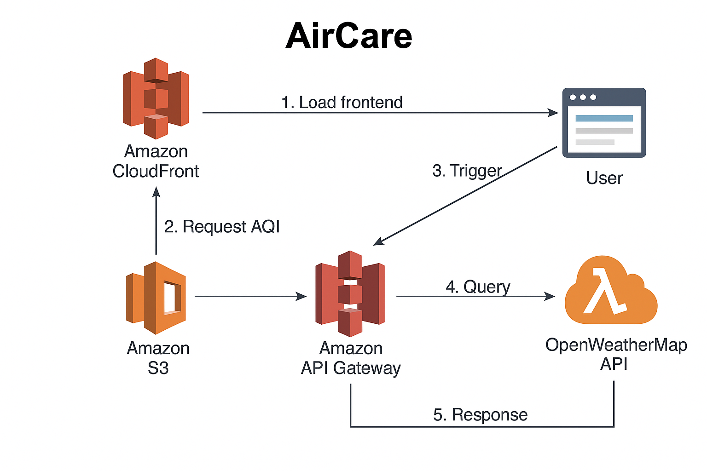

# 🌬️ AirCare – Real-Time Air Quality Monitoring


**AirCare** is a fully cloud-native application that displays real-time Air Quality Index (AQI) based on the user's geolocation. Built to demonstrate hands-on AWS services usage, it is fully deployed and automated using GitHub Actions.

🔗 [Live Demo](https://d385ybljdjmh2o.cloudfront.net)

---

## ⚙️ Key Features

- Automatic geolocation detection using the browser
- Manual city selector as fallback
- Reverse geocoding to display city name
- Secure backend call (AWS API Gateway + Lambda using Axios)
- AQI, PM2.5, and PM10 data retrieval and display
- Friendly message based on AQI level (1–5)
- Responsive and accessible frontend UI
- Full CI/CD pipeline:
  - Frontend deployment to S3
  - CloudFront cache invalidation
  - Lambda function packaging and deployment

---

## 🧭 Architecture Diagram



> Diagram generated with draw.io

**Architecture Flow**:
1. User accesses app via CloudFront (served from S3).
2. Frontend calls API Gateway with user's coordinates.
3. API Gateway triggers Lambda.
4. Lambda fetches AQI from OpenWeatherMap API.
5. Data is returned to frontend and displayed to user.

---

## 🧰 AWS Stack & Services Used

| Component         | Details                                     |
|------------------|---------------------------------------------|
| Frontend         | HTML / CSS / Vanilla JavaScript             |
| Backend          | AWS Lambda (Node.js + Axios)                |
| API Gateway      | HTTP API, POST method, CORS enabled         |
| CI/CD            | GitHub Actions (S3 deploy, CloudFront invalidation, Lambda update) |
| Hosting          | S3 static site + CloudFront CDN (HTTPS)     |
| Reverse Geocoding| OpenWeatherMap API                          |
| AQI Data         | OpenWeatherMap - Air Pollution endpoint     |

---

## 📁 Repository Structure

```plaintext
aircare/
├── aircare/                 # Frontend files
│   ├── index.html
│   ├── style.css
│   ├── script.js
│   └── assets/              # Images, fonts, etc.
├── aircare-lambda/          # Lambda function code
│   ├── index.js
│   ├── package.json
│   └── node_modules/
├── .github/workflows/       # CI/CD pipeline
│   └── deploy.yml
├── README.md
```

---

## 🚀 Deployment & CI/CD

1. Pushing to `main` triggers GitHub Actions
2. Frontend is synced to S3 (`aws s3 sync`)
3. CloudFront cache is invalidated (`aws cloudfront create-invalidation`)
4. Lambda function is packaged and deployed (`aws lambda update-function-code`)

---

🧠 Lessons Learned

Deploying secure and scalable frontend with S3 + CloudFront
Using Lambda/API Gateway for real-time API backend
Integrating external APIs (OpenWeatherMap)
Implementing CI with GitHub Actions
Designing AWS architectures for real-world use cases

---

## 🛠️ Planned Improvements

- **Infrastructure as Code (IaC)**: Add Terraform or AWS CloudFormation to manage infrastructure declaratively
- **Monitoring & Alerts**: Integrate AWS CloudWatch metrics and SNS alerts
- **AQI History Storage**: Use DynamoDB to store and visualize air quality trends

---

👨‍💻 Author

Bryan Nakache
🇫🇷 Bilingual French-English | ☁️ Aspiring Cloud Engineer
🔗 GitHub Profile