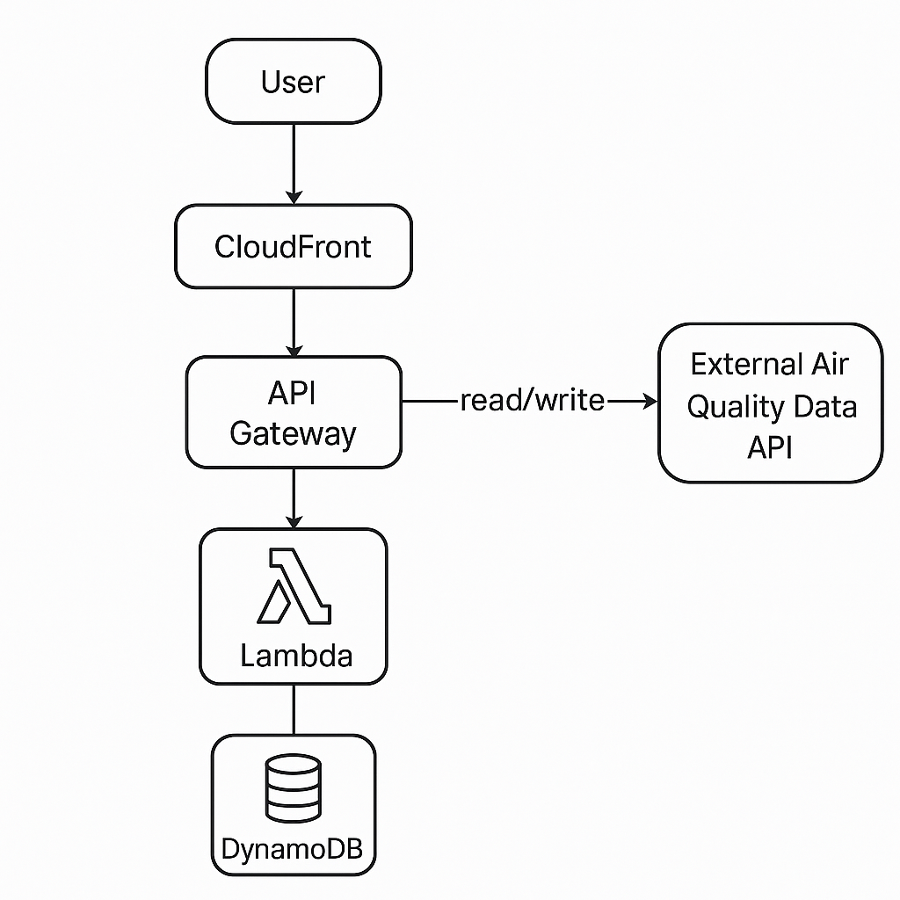

# AirCare

**AirCare** is a real-time air quality monitoring app designed to alert asthmatic users when local air conditions are unsafe. It is built using a serverless architecture on AWS and deployed with a fully automated CI/CD pipeline.

---

## 🚀 Features

- Live air quality updates based on user location
- AWS Lambda backend with API Gateway and DynamoDB
- CI/CD pipeline using GitHub Actions
- Frontend deployed to AWS S3 + CloudFront
- Designed with accessibility and mobile responsiveness in mind

---

## 🛠️ Tech Stack

- **Frontend**: Vite, JavaScript, HTML, CSS
- **Backend**: AWS Lambda (Node.js)
- **Cloud Services**: S3, API Gateway, Lambda, DynamoDB, IAM
- **CI/CD**: GitHub Actions

---

## 📷 Architecture Diagram

---

## 🧑‍💻 Getting Started

1. Clone the repository:
   \`\`\`bash
   git clone https://github.com/carmelo0511/aircare.git
   cd aircare/frontend
   \`\`\`

2. Install dependencies:
   \`\`\`bash
   npm install
   \`\`\`

3. Run the app locally:
   \`\`\`bash
   npm run dev
   \`\`\`

---

## 🌐 Live Demo

👉 [View the app here](https://d302ogxiv8pwst.cloudfront.net)

---

## 📚 What I Learned

- Setting up a serverless architecture with AWS
- Automating deployments and builds with GitHub Actions
- Using external APIs for real-time environmental data
- Designing for accessibility and user health needs

---

## 📈 Future Improvements

- Add login/authentication with Cognito or Firebase
- Enable push notifications for alert thresholds
- Add location-based filtering and user preferences

---

## 📄 License

This project is open-source and available under the MIT License.
